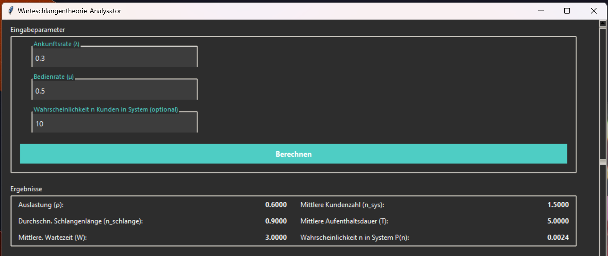
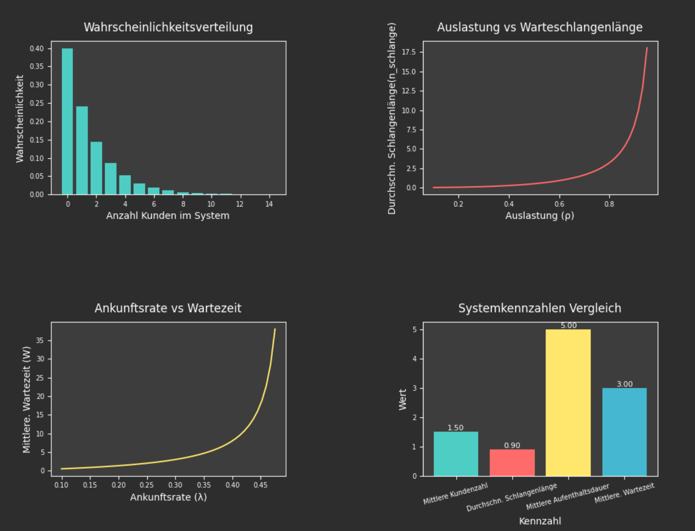

# Queuing Theory Analyzer (M/M/1 Model)

A Python application for analyzing single-server queues using queuing theory principles.

**NOTE: Application Language is in German**

*Example screenshot of the desktop application*

**Results**

**Graphs**


## Features

### Core Functionality
- **M/M/1 Queue Analysis**:
  - Utilization factor (ρ)
  - Average system customers (L)
  - Average queue length (Lq)
  - Average system time (W)
  - Average waiting time (Wq)
  - Probability of `n` customers in the system (P(n))
- **Interactive Plots**:
  - Probability distribution
  - Utilization vs. queue length
  - Arrival rate vs. waiting time
  - Metrics comparison

## Project Structure
    queuing-theory-solver/
    ├── model/ # Business logic
    │ └── mm1_queue.py # M/M/1 queue calculations
    │
    ├── view/ # GUI components
    │ ├── input_frame.py # Input fields with floating labels
    │ ├── result_frame.py # Results display
    │ └── plot_frame.py # Matplotlib visualizations
    │
    ├── controller/ # Application logic
    │ └── queue_controller.py
    │
    ├── main.py # Desktop application entry point
    ├── requirements.txt # Python dependencies
    └── README.md


## Getting Started

### Prerequisites
- Python 3.10+
- `pip` package manager

### Installation
1. Clone the repository:
   ```bash
   git clone https://github.com/sreeroo/Queuing-theory.git
   cd queuing-theory
   ```
   
2. Install dependencies:
```
pip install -r requirements.txt
```

### Usage(Desktop App)
```bash
python main.py 
```

### Input Guide:
1. Enter arrival rate (λ) and service rate (μ)
2. Optional: Specify n for probability calculation
3. Click "Berechnen" (Calculate)

### Contributing
1. Fork the repository 
2. Create a feature branch (git checkout -b feature/your-feature)
3. Commit changes (git commit -m 'Add some feature')
4. Push to branch (git push origin feature/your-feature)
5. Open a Pull Request

### License
Distributed under the MIT License. See LICENSE for details.

### Acknowledgements
- Queuing theory formulas from Operations Research under Professor Dr.Edda Eich Soellner at Munich University of Applied Sciences
- Matplotlib documentation for plot styling
- Tkinter modern UI patterns